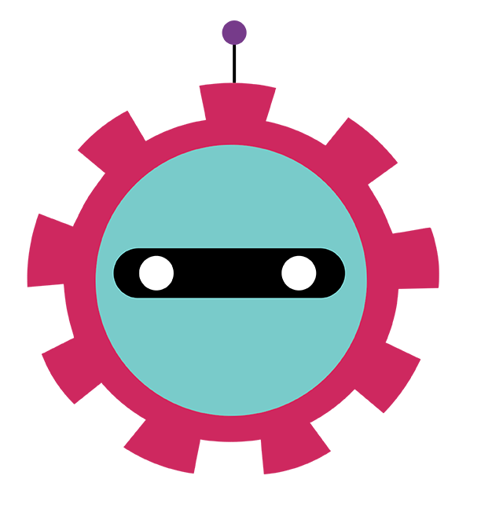
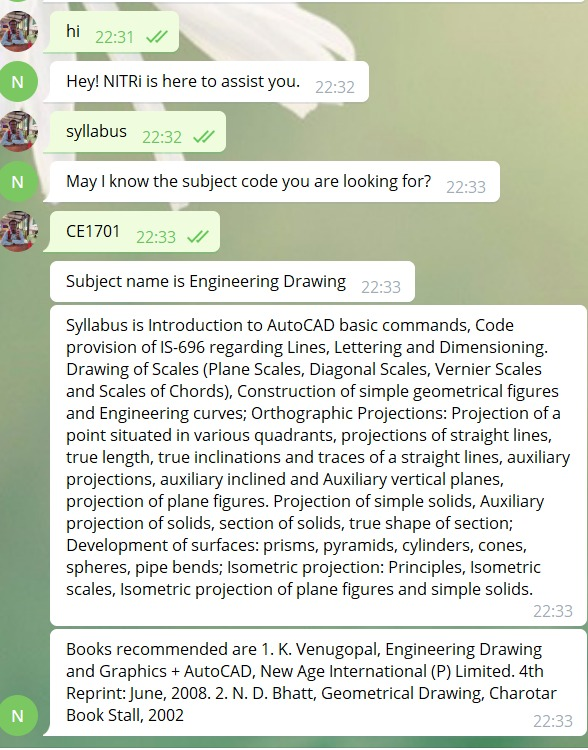

# NITRi  
A chatbot to help students know the syllabus of courses taken by them at NIT Rourkela/.
 ## Table of contents
* [General info](#general-info)
* [Technologies](#technologies)
* [Instructions of starting chatbot in Telegram](#instructions-of-starting-chatbot-in-telegram)
* [Illustrations](#illustrations)
* [Features](#features)
* [Issues](#issues)


## General info
This project involves building of chatbot that shows the students syllabus of the courses taken by them at NIT Rourkela.
	
## Technologies
Project is created with:
* Python 3.6
* RASA
* ngrok(Temporary)

	
## Setup
To run this project, install it locally and run it using ngrok

1. Open the application in any IDE you want example Pycharm or VSCode.

2. Make an virtual environment with Python 3.6.

3. Download the following dependencies required for installing RASA in your virtual environment


```
$ pip install rasa
$ pip install rasa-x==0.32.2 --extra-index-url https://pypi.rasa.com/simple
$ pip install spacy
$ python -m spacy download en
$ python -m spacy download en_core_web_md
$ python -m spacy link en_core_web_md en
$ pip install ujson
```

4. Now that is working train the model using the following command.

```
$ rasa train
```

5. Download the ngrok application for running the application in telegram:
[ngrok](https://ngrok.com/download)

6. replace the https://.... URL with webhook URL in credentials.yml file.

7. In order to train the model:
```
$ rasa train
```

8. Run the RASA application:

```
$ rasa run
```

9. In order to run the actions.py file run the following command in a new console:

```
$ rasa run actions
```

10. Go to telegram app and search for the bot named nitrkl_chatbot_syll_bot
[Telegram link](t.me/nitrkl_chatbot_syll_bot)

## Instructions of starting chatbot in Telegram

```
/start
hi
I want syllabus or Syllabus
Type any of the subject's code to know the syllabus
The syllabus will be shown
```

## Illustrations



## Features
### Todo

- [ ] Currently the chatbot working only on localhost. So it needs to be pushed to cloud.
- [ ] Update the syllabus for various subjects available in nitrkl. Currently available only for first year subjects.

## Issues

* Null fields are being displayed.
